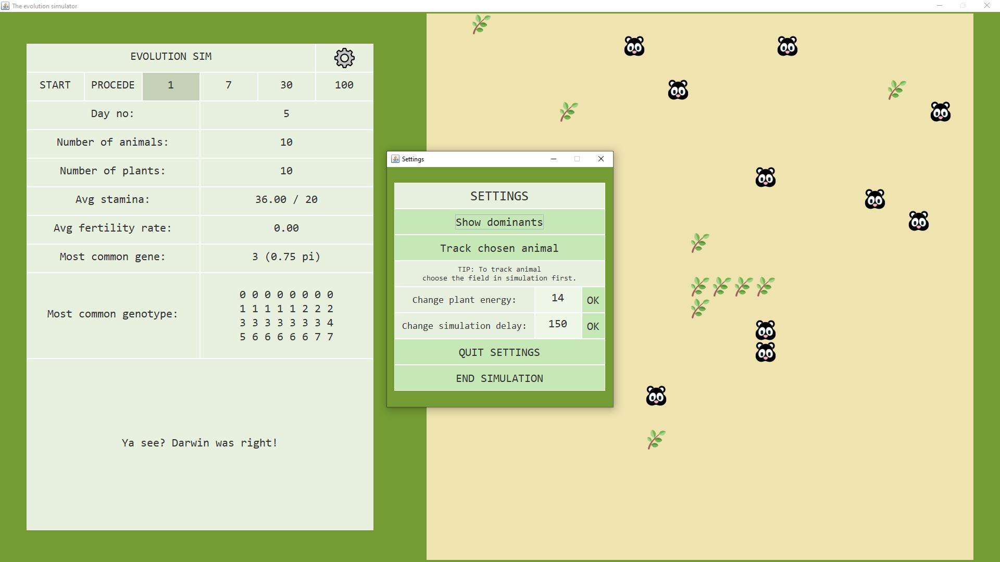

# OOP Project, Evolution

First project for Object-Oriented Programming course: The evolution simulator.

___

### Screenshots:

___

### Additional info

SDK 11

Libraries: org.json, JUnit4

Windows-style paths

Full HD resolution suggested
